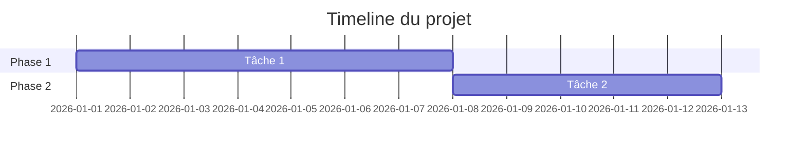

# 🚀 {{title}}

## 📋 Aperçu

| | |
|---|---|
| **Statut** | {{status}} |
| **Priorité** | {{priority}} |
| **Domaine** | {{area}} |
| **Deadline** | {{date_deadline}} |

## 🎯 Objectif
> Quel est le résultat final attendu ?


## 💡 Pourquoi ce projet ?


## ✅ Critères de succès
- [ ]
- [ ]
- [ ]

## 📊 Progression

```dataview
TASK
FROM "03-Projects/{{title}}"
GROUP BY completed
```

### Jalons
- [ ] 🏁 Jalon 1 - Date:
- [ ] 🏁 Jalon 2 - Date:
- [ ] 🏁 Jalon finale - Date:

## 📝 Tâches

### À faire
- [ ]

### En cours
- [ ]

### Complété
- [x]

## 📅 Timeline


## 📁 Ressources
-

## 👥 Personnes impliquées
-

## 📝 Notes


## 💭 Réflexions / Retours


## 🔗 Liens
- [[04-Areas/{{area}}|Domaine associé]]

## 🏷️ Tags
#project #{{area}} #{{status}}
